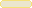
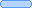
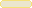
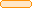
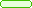

<!-- modrinth_exclude.start -->


<!-- modrinth_exclude.end -->

# Create Track Map: Unofficial fork


<!--
[](https://modrinth.com/mod/create-fabric)
[](https://modrinth.com/mod/fabric-api)
[](https://modrinth.com/mod/fabric-language-kotlin)-->


[](https://modrinth.com/mod/create)
[]((https://modrinth.com/mod/fabric-api))
[](https://modrinth.com/mod/fabric-language-kotlin)



[](https://modrinth.com/mod/create)
[](https://modrinth.com/mod/kotlin-for-forge)

[](https://github.com/jenchanws/create-track-map)
[](https://modrinth.com/mod/create-track-map)
[](https://modrinth.com/mod/create-track-map)

### Fork notice

This is a fork of [jenchanws/create-track-map](https://github.com/jenchanws/create-track-map) - while I have been given permission to publicly release my changes under a separate modrinth/curseforge page, this is not endorsed by jenchanws - Please do not contact her regarding issues with this fork, and all issues regarding this version of the mod should go *here* and ***not*** in the original repository

### Summary

A multi-loader mod that displays a track map of Create trains in your world,
including all tracks, signals, stations, and trains. The signals and
trains are updated in (practically) real time.


### Usage

CTM is intended to be a server side mod, but can also run in single-player worlds and LAN servers. It runs a web server, on port 3876 by default, that provides the following API:

- `/api/network`, `/api/network.rt`: List of all track pieces and train stations
- `/api/signals`, `/api/signals.rt`: List of all train signals, including their states
  (green, yellow, red)
- `/api/blocks`, `/api/blocks.rt`: List of all signal control blocks, and whether they are occupied or reserved by a train
- `/api/trains`, `/api/trains.rt`: List of all assembled trains, including their names and
  positions
- `/api/style.css`: CSS style sheet generated from configured colors and fonts
- `/api/config.json`: Map configuration

The `.rt` versions update in real time with Server-Sent Events (SSE). If using a proxy to serve the map, make sure to configure it to let Server-Sent Events through.

The map itself is visible at the root (by default `http://localhost:3876/`).

### Configuration

CTM's config options can be found at `create-track-map.json` in your server's config directory. It is automatically created at startup if it doesn't exist.

The following options are available:

```js
{
  // Whether to actually start the watcher and the server.
  "enable": false,

  // How long to wait between track data updates.
  "watch_interval_seconds": 0.5,
  // The port the internal web server listens on.
  "server_port": 3876,

  "map_style": {
    // Font to use for the map's UI. Must be a valid CSS font stack.
    "font": "ui-monospace, \"JetBrains Mono\", monospace",
    // Colors for individual components of the map. Must be valid CSS colors.
    // Any CSS color format will work, such as named colors and rgb().
    "colors": {
      "background": "#888",
      "track": {
        "occupied": "red",
        "reserved": "pink",
        "free": "white"
      },
      "signal": {
        "green": "#71db51",
        "yellow": "#ffd15c",
        "red": "#ff5f5c",
        "outline": "black"
      },
      "portal": {
        "primary": "purple",
        "outline": "white"
      },
      "station": {
        "primary": "white",
        "outline": "black"
      },
      "train": "cyan",
      "lead_car": "darkturquoise"
    }
  },

  "map_view": {
    "initial_dimension": "minecraft:overworld",
    "initial_position": { "x": 0, "z": 0 },

    // Zoom levels must be integers, but may be negative.
    // Each zoom level is twice as big as the previous.
    // 0 is a decent minimum but may be impractical for large networks.
    // 3 is the sensible default for viewing double-tracked networks.
    "initial_zoom": 3,
    "min_zoom": 0,
    "max_zoom": 4,

    // Whether a zoom control should be visible on the screen.
    "zoom_controls": true,

    // Which side of the track a signal should be displayed on.
    // Valid values are LEFT or RIGHT (all uppercase).
    "signals_on": "RIGHT"
  },

  "dimensions": {
    // Dimension names must be namespaced.
    "minecraft:overworld": {
      // Label that shows up in the layer switcher.
      "label": "Overworld"
    },
    "minecraft:the_nether": {
      "label": "Nether"
    },
    "minecraft:the_end": {
      "label": "End"
    }
  },

  "layers": {
    "tracks": {
      "label": "Tracks",
      "min_zoom": 0,
      "max_zoom": 4
    },
    "blocks": {
      "label": "Track Occupancy",
      "min_zoom": 0,
      "max_zoom": 4
    },
    "signals": {
      "label": "Signals",
      "min_zoom": 0,
      "max_zoom": 4
    },
    "portals": {
      "label": "Portals",
      "min_zoom": 0,
      "max_zoom": 4
    },
    "stations": {
      "label": "Stations",
      "min_zoom": 0,
      "max_zoom": 4
    },
    "trains": {
      "label": "Trains",
      "min_zoom": 0,
      "max_zoom": 4
    }
  }
}
```

Reload the config without restarting the server by running `/ctm reload` (operator permissions required).
